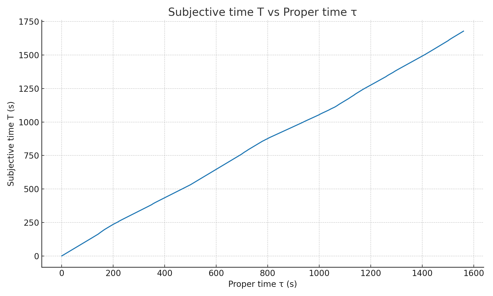
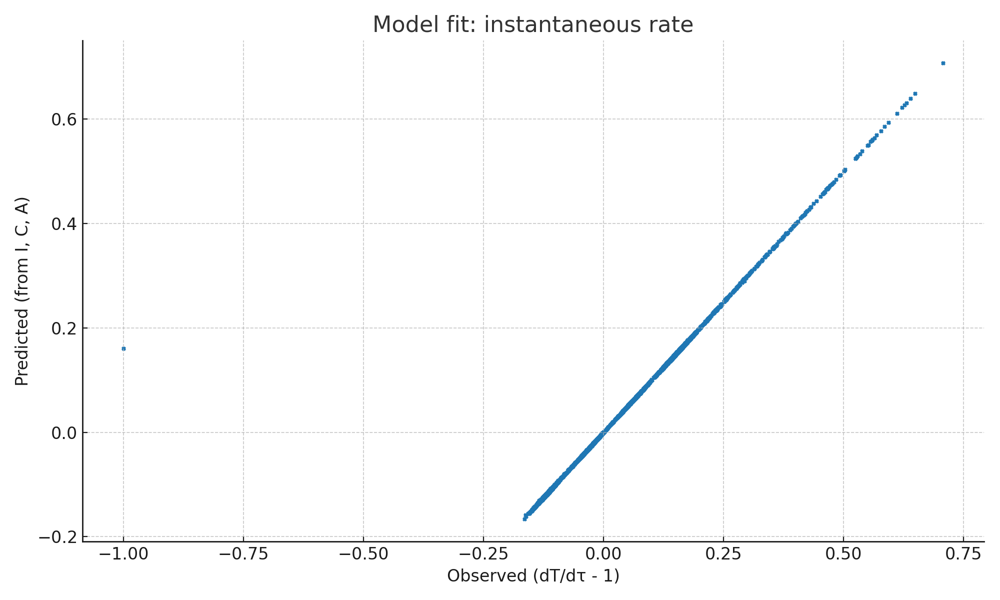

# RPT：相対論的・心理物理的時間モデル（Relativistic Psychophysical Time）
*ver. 0.1 — 2025-08-10 07:59 JST*

## TL;DR
- **目的**：物理の「固有時間」と、人間の「体感時間」を同一フレームで統合する。
- **要旨**：相対論の固有時間 \( \tau \) に、心理生理レート \( \Lambda(\mathbf{z}(t)) \) を掛けることで、主観時間 \( T \) を定義。  
  \[ dT = \Lambda(\mathbf{z}(t))\, d\tau \]
- **含意**：時間のズレは二層（物理×心理）で決まり、乗算的に効く。GPSや加速粒子での“物理的遅れ”と、驚き・覚醒・負荷などの“主観的伸縮”を一度に扱える。

---

## 1. 背景と狙い
「時間の遅れ」は相対論では**速度**や**重力ポテンシャル**差から導かれる。一方で、私たちの体感は**驚き/新奇性**、**認知負荷**、**覚醒度**などで伸び縮みする。  
本稿はこの二つを **RPT（Relativistic Psychophysical Time）** として統合し、実験可能・推定可能な最小モデルを提示する。

## 2. 物理：固有時間 \( \tau \)
弱重力・低速近似では
\[
d\tau \approx dt\left(1+\frac{\Phi}{c^2}-\frac{v^2}{2c^2}\right),
\]
厳密には \( d\tau = dt/\gamma \)（特殊相対論; \( \gamma=1/\sqrt{1-v^2/c^2} \)）、重力は一般相対論的補正で置き換え可能。

## 3. 心理：体感レート \( \Lambda \)
主観時間の瞬時レートを
\[
\Lambda(\mathbf{z}) = 1 + \alpha\,I(t) + \beta\,C(t) + \gamma\,A(t),
\]
と定義する。ここで \(I\) は**サプライズ率**、\(C\) は**認知負荷**、\(A\) は**覚醒度**。係数 \(\alpha,\beta,\gamma\) は**個体差**を表す。

> **定義（RPT）**  
> \[
> \boxed{~ T(t) = \int_0^{t} \Lambda(\mathbf{z}(s))\, d\tau(s) \;+\; \Delta ~}
> \]
> \(\Delta\) は低周波ゆらぎ（情動ドリフト等）。

## 4. 性質
- **ローレンツ整合**：\(\tau\) は不変量。 \(\Lambda\) が世界線上の状態にだけ依存する限り、\(T\) は観測系によらず定義できる。  
- **基準一致**：\(\Lambda\equiv 1 \Rightarrow T=\tau\)。  
- **二重の時間ずれ**：外部系の時刻 \(t\) に対して
\[
\frac{dT}{dt}=\Lambda(\mathbf{z})\left(1+\frac{\Phi}{c^{2}}-\frac{v^{2}}{2c^{2}}\right).
\]

## 5. 最小実装（推定可能形）
離散時間 \(\{t_k\}\) で
\[
T_{k+1}=T_k+\Lambda(\mathbf{z}_k)\,\Delta\tau_k,\quad
\Delta\tau_k=\int_{t_k}^{t_{k+1}}\!\left(1+\frac{\Phi}{c^{2}}-\frac{v^{2}}{2c^{2}}\right)\,dt.
\]
推定は瞬間レート
\[
\left(\frac{dT}{d\tau}-1\right)_k \approx \alpha I_k + \beta C_k + \gamma A_k
\]
を用いて線形回帰。または非線形（例：\(\Lambda=\exp(\theta^\top \mathbf{x})\)）も可能。

## 6. シミュレーションと当てはめ
本稿に付属のデータとノートブックで再現できる。下図は**主観時間 \(T\)** と **固有時間 \( \tau \)** の関係の一例：

瞬間レートのフィット（観測 vs 予測）：

**結果例（真値→推定）**：  
- \(\alpha\): 0.60 → 0.606  
- \(\beta\): −0.30 → −0.299  
- \(\gamma\): 0.50 → 0.498

## 7. 実験デザインの雛形
- **E1: 二地点・二条件交差**：地上/高層/移動（速度差）× 低/高覚醒・高/低負荷。  
- **E2: VR予測可能性操作**：秒数・フレーム一定で刺激統計のみ操作し、\(I\) を制御。  
測定候補：瞳孔径、HRV/EDA、タスクログ、確率学習の予測誤差。

## 8. データの作り方
同梱の `RPT_blank_template.csv` に以下の列を入れる：
- `t_sec`（秒）
- `v_m_per_s`（速度）
- `Phi_m2_per_s2`（重力ポテンシャル近似。未測定なら0）
- `I_surprise`（予測誤差代理; 正規化）
- `C_cogload`（0–1）
- `A_arousal`（0–1）

## 9. 応用と限界
- **応用**：VR/ゲームデザインの没入評価、航空・宇宙での主観時間補正、臨床（不安・うつ）での時間知覚モデル化。  
- **限界**：\(I,C,A\) の推定法に依存。\(\Delta\) の扱いは現状単純。一般相対論の厳密場では近似を超える定式化が必要。

## 10. 研究倫理
生体計測はインフォームド・コンセント、匿名化、二次利用規定を厳守。覚醒度操作は安全域を守ること。

## 付録A：擬似データとコード
- データ：`RPT_simulated_data.csv`  
- 空テンプレ：`RPT_blank_template.csv`  
- ノートブック：`RPT_demo.ipynb`  
- 図：`T_vs_tau.png`, `fit_scatter.png`

## 付録B：関連文献（抜粋の一般的項目名）
- Einstein (1905). Zur Elektrodynamik bewegter Körper.  
- Einstein (1916/1918). Die Grundlage der allgemeinen Relativitätstheorie.  
- （時間知覚レビュー）Eagleman D. (2008) Human time perception… / Wittmann M. (2013) The inner experience of time… など

---  
*連絡: 公開後の改稿は随時。引用・再配布はリンク明記で可。*
