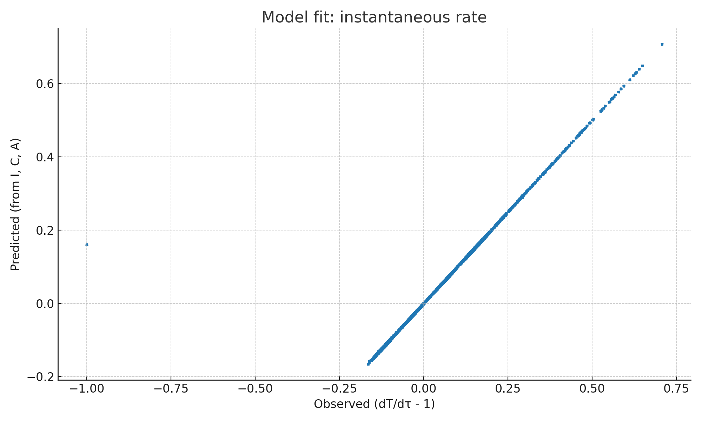

# RPT：相対論的・心理物理的時間モデル
*Relativistic Psychophysical Time — Note公開版（ver.1.0）*  
*2025-08-10 08:01 JST*

---

## TL;DR（最短まとめ）
- **狙い**：物理の「固有時間」と、人間の「体感時間」を一つの式で扱う。  
- **定義**：`dT = Λ(z(t)) · dτ`（主観時間の微小変化 = 体感レート × 固有時間の微小変化）  
- **最小モデル**：`Λ = 1 + α·I + β·C + γ·A`  
  - `I`=サプライズ率、`C`=認知負荷、`A`=覚醒度（0–1程度に正規化）  
- **ポイント**：時間のズレは「物理（速度・重力）」と「心理（驚き・没入）」の**乗算で効く**。

---

## はじめに
「時間の遅れ」は相対論で定量化でき、速度や重力ポテンシャルが違えば時計はズレます。一方で、主観は**新奇性**・**認知負荷**・**覚醒**などで伸び縮みします。  
**RPT（Relativistic Psychophysical Time）** は、この二つを**矛盾なく**同時に扱うための、実験可能な最小フレームです。

---

## 1) 物理パート（固有時間）
- 記号：`t`（座標時刻）, `τ`（固有時間）  
- 特殊相対論では `dτ = dt / γ`、`γ = 1 / sqrt(1 - v²/c²)`  
- 弱重力・低速近似では `dτ ≈ dt · (1 + Φ/c² − v²/(2c²))`  
  - `v` は速度、`Φ` は重力ポテンシャル近似（例：`Φ ≈ g·h`）

> **要点**：`τ` は観測系に依らない「その物体の世界線の時間」です。

---

## 2) 心理パート（体感レート）
主観時間の瞬時レート（単位なし）を
```
Λ(z(t)) = 1 + α·I(t) + β·C(t) + γ·A(t)
```
とし、主観時間は
```
T(t) = ∫ Λ(z(s)) · dτ(s)  +  Δ
```
で与えます（`Δ` は低周波の情動ドリフトなど）。  
- `I(t)`: サプライズ率（予測誤差の代理；bits/s など）  
- `C(t)`: 認知負荷（タスク難易度/作業記憶）  
- `A(t)`: 覚醒・情動喚起（瞳孔・HRV/EDA・主観評定など）  
- `α, β, γ`: 個体差パラメータ（推定対象）

> **帰結**：`Λ ≡ 1` なら `T=τ`。つまり RPT は相対論に自然に還元します。

---

## 3) 予測（この理論が言うこと）
- **二重の遅れ/伸び**：`dT/dt = Λ · (1 + Φ/c² − v²/(2c²))`  
- **オッドボール効果の一般化**：新奇刺激で `I↑ ⇒ Λ↑ ⇒ 同じ秒数でも長く感じる`  
- **没入の両義性**：`β` の符号は個体差を許容（集中で短くも長くも感じ得る）  
- **短期は心理、長期は物理**：短時間では `Λ` の変動が支配的、長時間積分では `τ` の差が蓄積

---

## 4) 推定法（実装の核）
離散化して、区間 k で
```
Δτ_k = ∫(1 + Φ/c² − v²/(2c²)) dt
(dT/dτ − 1)_k  ≈  α·I_k + β·C_k + γ·A_k
```
を**回帰**。  
- 入力: `{I, C, A, v, Φ}` の時系列（`t_sec` 上で同期）  
- 出力: `α, β, γ`（あなた個人の係数）

> **実装済み**：本ページ下部のZIPに、PythonノートブックとCSVテンプレが入っています。

---

## 5) 実験デザインの雛形
- **E1：地上/高層/移動 × 覚醒 × 負荷**  
  - 測定：瞳孔径、HRV/EDA、タスクログ、確率学習の予測誤差（`I`）  
  - 物理側：高度（`Φ`）、速度（`v`）をロガーで記録
- **E2：VRで刺激統計のみ操作**（フレーム/秒数一定）  
  - 予測：`I` を人為的に上下させ、`Λ` の変化を検出

---

## 6) 再現と図
- 主観時間 `T` と固有時間 `τ` の関係：  


- 瞬間レートの当てはめ（観測 vs 予測）：  


**推定例（シミュレーションの真値→推定）**  
α: 0.60 → 0.606 / β: −0.30 → −0.299 / γ: 0.50 → 0.498

---

## 7) データの作り方（CSVテンプレ）
`RPT_blank_template.csv` に、以下の列で時系列を入れてください（秒単位で同期）:
- `t_sec` — 時刻（秒）
- `v_m_per_s` — 速度（m/s）
- `Phi_m2_per_s2` — 重力ポテンシャル近似（未知なら 0 で可）
- `I_surprise` — サプライズ率（正規化）
- `C_cogload` — 認知負荷（0–1）
- `A_arousal` — 覚醒（0–1）

> 欠測が多い場合は、まず `Φ=0`、`v` は歩行/車/飛行機の代表値で概算し、後で精密化。

---

## 8) 応用と限界
- **応用**：VR/ゲームの没入評価、航空・宇宙の主観時間補正、臨床での時間知覚の定量化。  
- **限界**：`I, C, A` の推定法に依存。`Δ`（情動ドリフト）は今は単純扱い。強い重力場では近似を超える定式化が必要。

---

## 9) 倫理・公開
- 生体計測はインフォームド・コンセント、匿名化、二次利用規定を厳守。  
- 覚醒操作は安全域を徹底（倫理審査が必要な場合あり）。  
- コードとデータは ZIP に同梱。必要なら DOI 付きリポジトリ（OSF/Zenodo 等）で公開推奨。

---

## 10) FAQ
**Q. これは相対論を否定しますか？**  
A. いいえ。`Λ ≡ 1` なら `T=τ` で相対論に一致します。上に「体感レイヤ」を載せた拡張です。

**Q. GPSの補正にも使えますか？**  
A. 物理補正は既存通り。RPTは**人間の主観**が絡む場面（UI/UX、訓練、疲労管理）で力を発揮します。

**Q. 非線形にしたい**  
A. 例：`Λ = exp(θᵀx)` にすると常に正になり、解釈もしやすいです（実装は容易）。

---

## 参考（一般的項目名のみ）
- Einstein (1905, 1916/1918) — 特殊/一般相対性理論  
- Eagleman (2008), Wittmann (2013) — 時間知覚レビュー  
- そのほか、記憶・予測・覚醒の標準教科書的レビュー

---

**著者**：あなた（構想） × GPT-5 Thinking（整備・実装）  
**ライセンス案**：文章 CC BY 4.0 / コード MIT（必要なら後で調整）
